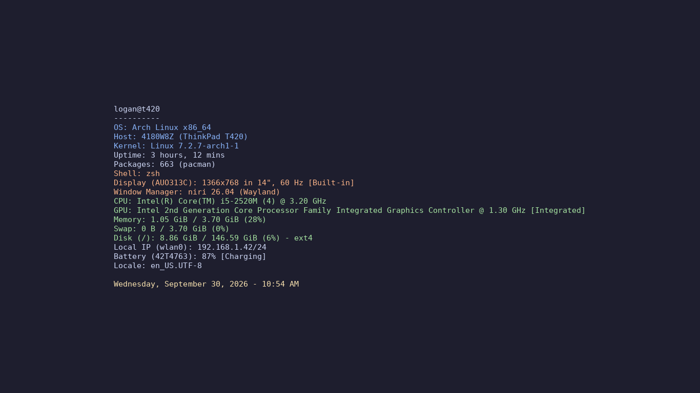

# wallpaper-niri

A live system-info wallpaper for [niri](https://github.com/YaLTeR/niri) (and other Wayland compositors that support layer-shell). Every 15 seconds it checks [`fastfetch`](https://github.com/fastfetch-cli/fastfetch) and, if anything changed, renders the output onto a Catppuccin-style background and cross-fades it in with `awww`.

This is the Wayland/niri port of [`../wallpaper/neofetch_wallpaper_kde.py`](../wallpaper/neofetch_wallpaper_kde.py), which depended on KDE's `plasma-apply-wallpaperimage`.



The screenshot uses sample values.

## Requirements

| Package (Arch) | Why |
|---|---|
| `niri` | screen size is read with `niri msg --json outputs` (falls back to 1366x768 if that fails) |
| `awww` | sets the wallpaper (`awww-daemon` must be running; `awww` was formerly called `swww`) |
| `fastfetch` | the system info |
| `python-pillow` | draws the image |
| `ttf-dejavu` | default font (falls back to JetBrains Mono, Fira Code, Liberation Mono, Noto Sans Mono, then Pillow's built-in font) |

```bash
sudo pacman -S awww fastfetch python-pillow ttf-dejavu
```

## Install

```bash
# 1. the script
install -Dm755 sysinfo-wallpaper ~/.local/bin/sysinfo-wallpaper

# 2. start awww-daemon with niri — add this line to ~/.config/niri/config.kdl
#    spawn-at-startup "awww-daemon"

# 3. run it as a systemd user service
install -Dm644 sysinfo-wallpaper.service ~/.config/systemd/user/sysinfo-wallpaper.service
systemctl --user daemon-reload
systemctl --user enable --now sysinfo-wallpaper.service
```

The service is tied to `graphical-session.target`, so it starts and stops with your niri session. If it starts before `awww-daemon` is ready, the script waits up to 30 seconds for it.

## Usage

```bash
sysinfo-wallpaper --once                     # render and apply one frame, then exit
systemctl --user restart sysinfo-wallpaper   # after editing the script
journalctl --user -u sysinfo-wallpaper       # logs
```

## How it works

- Runs `fastfetch --pipe --logo none` with a fixed module list, so the output is plain text with no ANSI codes.
- Renders it centered on a `#1e1e2e` background at the screen's logical size, with line colors by category (system in blue, hardware in green, desktop in orange, date in yellow).
- Only re-renders when the fastfetch text actually changed. Uptime, memory, battery and IP all change, so in practice it redraws about once a minute.
- Writes the PNG to `~/.cache/sysinfo-wallpaper/wallpaper.png` (or `$XDG_CACHE_HOME`) through a temp file and rename, so `awww` never reads a half-written image.
- Applies it with a 0.7 second fade.

## Configuration

Edit the constants near the top of `sysinfo-wallpaper`:

| Setting | What it does |
|---|---|
| `INTERVAL` | seconds between checks (default 15) |
| `MODULES` | fastfetch modules shown, colon-separated (run `fastfetch --list-modules` for names) |
| `FONT_PATHS` | fonts tried in order |

Colors are in `create_wallpaper()`. The `Terminal` module is left out on purpose, because under systemd it always reports "systemd". The `Shell` line uses `$SHELL` for the same reason: fastfetch reports its parent process.

## Differences from the KDE version

| | `../wallpaper` (KDE) | `wallpaper-niri` |
|---|---|---|
| Info source | `neofetch` (unmaintained) | `fastfetch` |
| Applies wallpaper with | `plasma-apply-wallpaperimage` | `awww` (fade transition) |
| Resolution | hardcoded 1920x1080 | read from niri |
| Output | `~/Downloads/wallpaper/`, cleared each time | `~/.cache/sysinfo-wallpaper/`, single file |
| Paths | hardcoded `/home/logan` | none hardcoded (`%h` in the service) |

## Notes

- Only tested on niri with a single screen. On a multi-monitor setup the image is sized to the first output niri reports, and `awww img` applies it to every output.
- On another compositor, `get_screen_size()` is the only niri-specific part. Replace it (e.g. with `wlr-randr`) or rely on the 1366x768 fallback.
